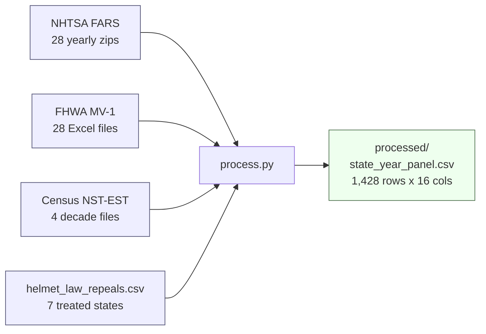
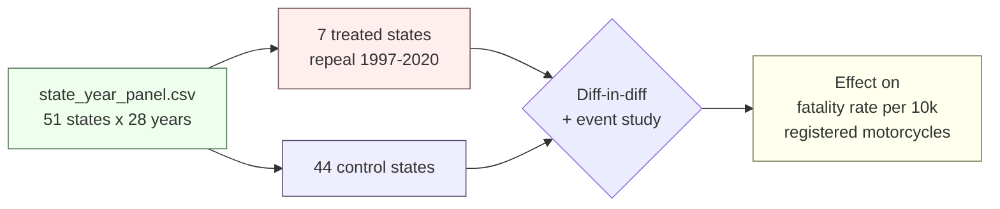

# Motorcycle helmet law repeals and fatality rates

Causal question: does repealing a universal motorcycle helmet law increase motorcycle fatalities? We answer it with a difference-in-differences design over seven treated states (Arkansas 1997, Texas 1997, Kentucky 1998, Florida 2000, Pennsylvania 2003, Michigan 2012, Missouri 2020) against the rest of the country, 1995-2022.

## Data collection



FARS gives motorcycle-occupant fatalities. FHWA MV-1 gives registered motorcycles per state-year (primary denominator). Census NST-EST gives state population (robustness denominator). The policy CSV encodes the treatment dates. `process.py` joins them into one state-year panel.

## How the panel supports the causal question



## Reproduce

```
cd data
python process.py
```

Reads everything from `data/raw/`, writes `data/processed/state_year_panel.csv`. No network calls, no manual steps.

## More

Data-layer details (sources, formats, column schema, known issues): see [data/README.md](data/README.md).
