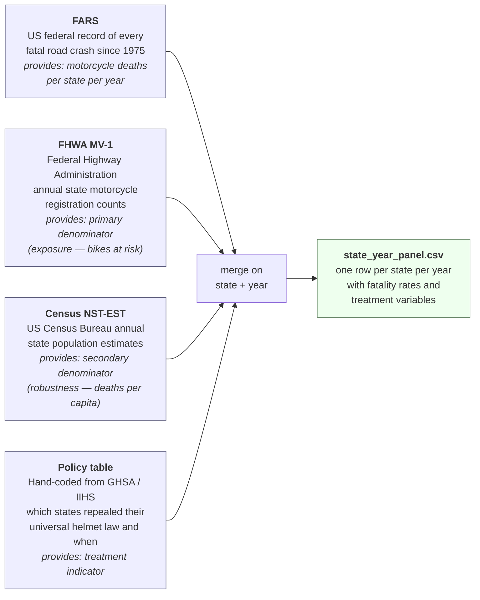
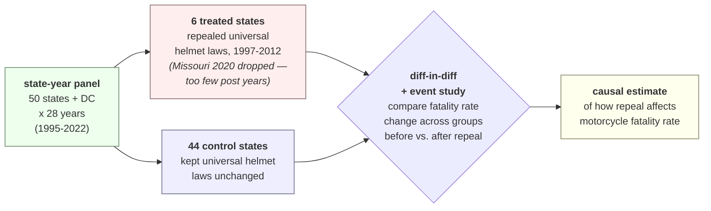

# Motorcycle helmet law repeals and fatality rates

Causal question: does repealing a universal motorcycle helmet law increase motorcycle fatalities? We answer it with a difference-in-differences design over seven states that repealed their universal laws between 1997 and 2020 (Arkansas, Texas, Kentucky, Florida, Pennsylvania, Michigan, Missouri) against the rest of the country, 1995-2022. Missouri is in the panel but excluded from estimation (2020 repeal leaves too few post-period years; see `models/README.md` §4), so the DiD models are fit on six treated states vs. 44 controls.

## Data collection

Four independent sources are needed because no single dataset contains both the numerator (motorcycle deaths) and the denominator (how many motorcycles or people are at risk) together with the treatment timing. The pipeline joins them into one state-year panel.



## How the panel supports the causal question

Difference-in-differences asks: *did fatality rates in repeal states change more after the repeal than fatality rates in non-repeal states over the same years?* If yes, the extra change is the causal effect of the repeal. The panel is structured so this comparison is a direct computation.



## Reproduce

```
cd data
python process.py
```

Reads `data/raw/`, writes `data/processed/state_year_panel.csv`. No network calls, no manual steps.

## More

- **Data dictionary** (every column in the processed panel, with type, source, and definition): [data/processed/schema.md](data/processed/schema.md)
- **Raw-data inventory** (what's in `raw/` by folder, source URLs, format quirks): [data/README.md](data/README.md)
- **EDA notebook** (how the cleaning decisions were reached, with validation against NHTSA's published totals): [data/eda.ipynb](data/eda.ipynb)
